# SnakeWay

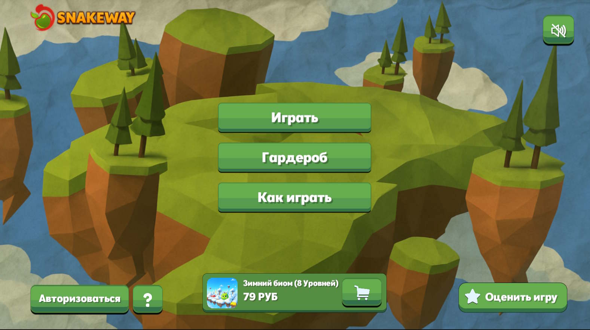  

## Описание игры

**SnakeWay** — это пошаговая логическая игра, которая переворачивает классическую змейку с ног на голову. В этот раз вы управляете не змейкой, а едой, и ваша цель – убегать от преследующих вас голодных змей.

Ваша задача – собирать энергетические звёзды, чтобы переходить между уровнями и исследовать разные биомы. Но будьте внимательны: змеи будут преследовать вас и пытаться загнать в угол.

Основные особенности:

- Разнообразные уровни в одиночном режиме, требующие тактического мышления.

- Смена времён года – лето и зима, которые влияют на визуальный стиль и игровой процесс.

- Простое управление и минималистичный визуальный дизайн.

Попробуйте выжить в этом необычном мире, где еда стала главной целью!

## Управление

Ваша задача - Собрать звёзды на уровне и дойти до финиша (желтый блок).

W - Двигаться вперёд
S - Двигаться назад
A - Двигаться влево
D - Двигаться вправо
Escape - Меню паузы
Зажатие левой кнопки мыши - Вращать камеру

По желанию вы можете двигаться стрелками на клавиатуре.

## Особенности игры

- Low Poly графика
- Разнообразные уровни с увеличивающейся сложностью
- Логика змей с использование алгоритма поиска пути
- Система локализации (Русская, Английский, Турецкий)
- Система сохранения прогрессии
- Система покупок и рекламы Яндекс.Игры
- Социальные активности (оставить отзыв, авторизация)
- Процедурная генерация меша тела змеи

## Запуск проекта для разработки

1. Убедитесь, что у вас установлена **Unity версии 6000.0.38f1**
2. Клонируйте репозиторий или скачайте проект
3. Откройте Unity Hub
4. Нажмите "Open" и выберите папку с проектом
5. Дождитесь окончания импорта ассетов
6. Откройте сцену `Assets/Scenes/MainMenu.unity` (или другую стартовую сцену)
7. Нажмите Play в редакторе Unity для тестирования

## Скриншоты и медиа

Полную галерею скриншотов и геймплейных видео можно посмотреть по ссылке:  
[Посмотреть все скриншоты игры](https://github.com/BagmanG/SnakeWay/tree/main/Screenshots)  

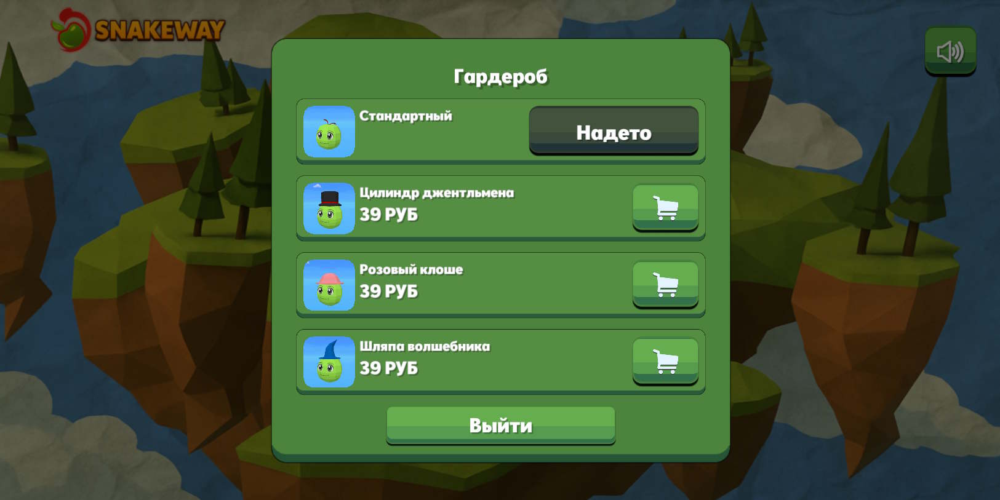  
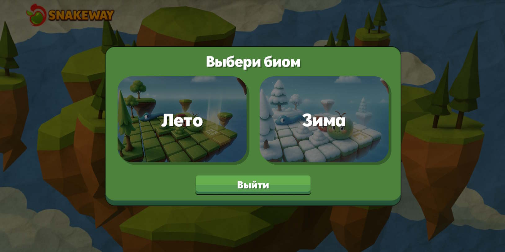  
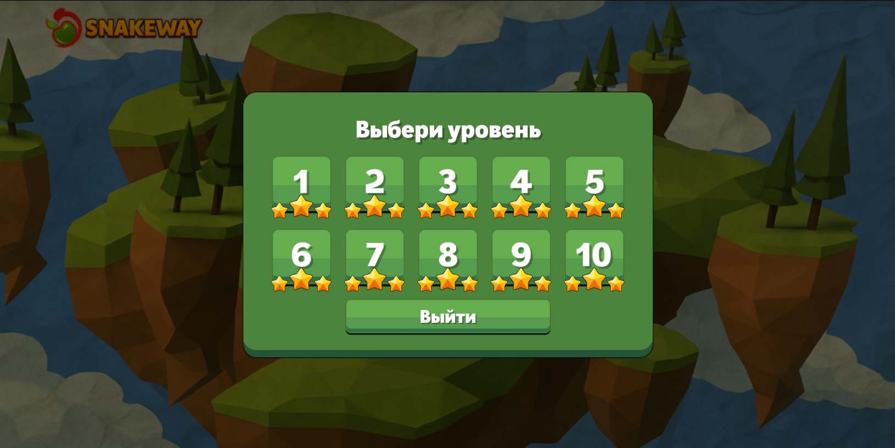  
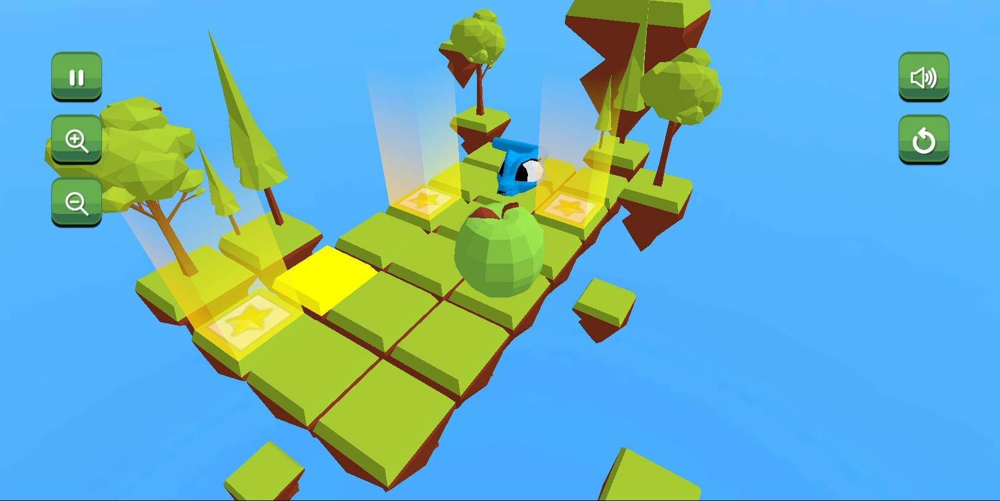
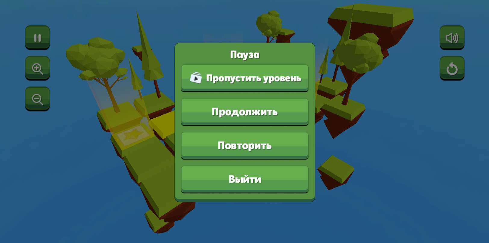  
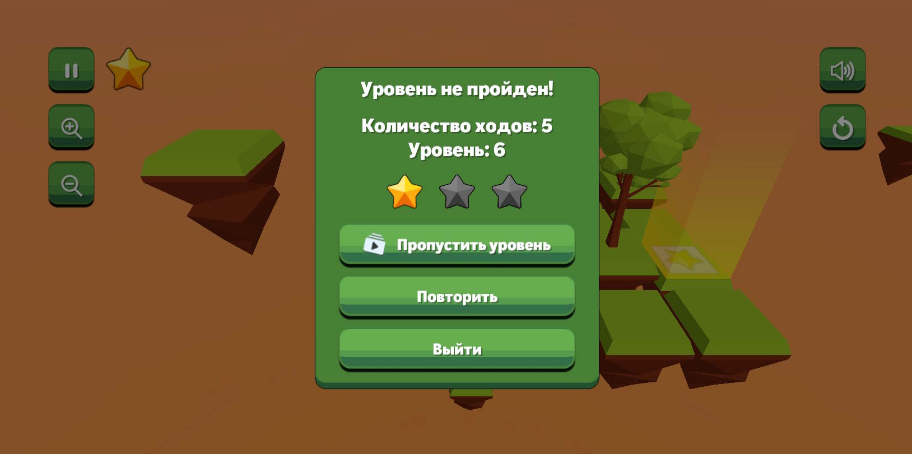  
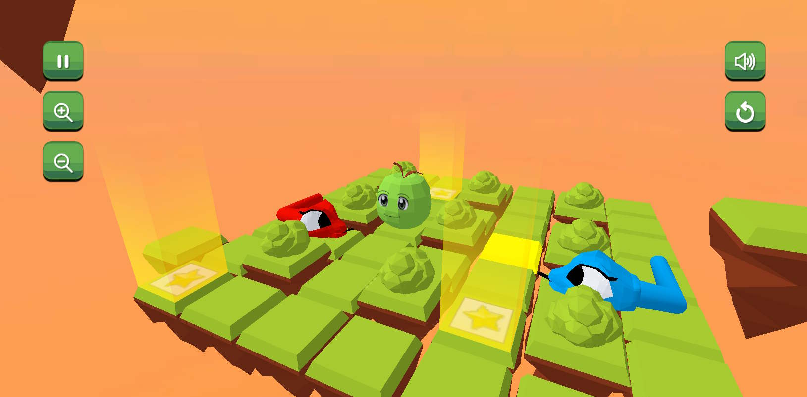  
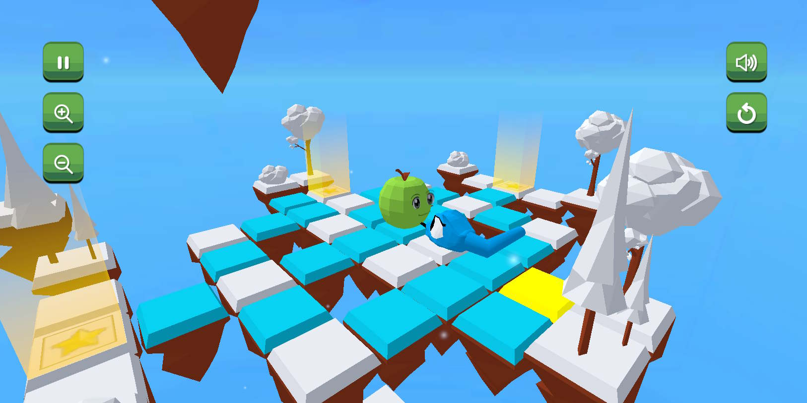  
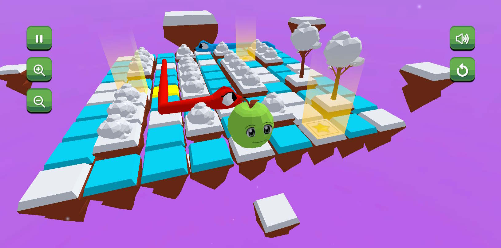  
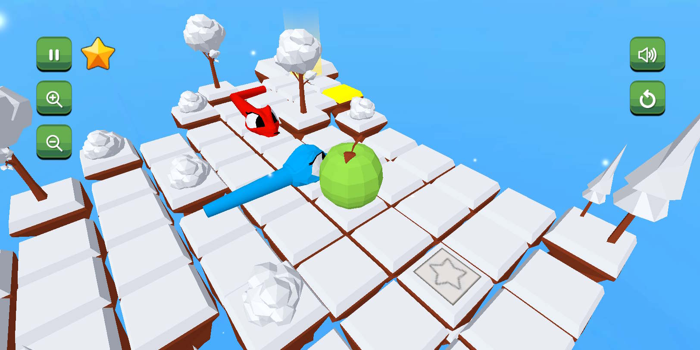  

## Сборка игры

1. Перейдите в `File > Build Settings`
2. Выберите платформу (Windows, Mac, Linux, Web)
3. Нажмите "Build" и выберите папку для сохранения

## Системные требования

**Для запуска в редакторе:**
- **ОС**: Windows 10/11 или macOS 10.14+
- **Unity**: версия 6000.0.38f1
- **Память**: 8 GB RAM (рекомендуется 16 GB)
- **Видеокарта**: с поддержкой DirectX 11/Metal

**Для собранной версии:**
- **ОС**: Windows 8.1+, macOS 10.13+, Linux
- **Память**: 4 GB RAM
- **Видеокарта**: Intel HD Graphics 4000 или лучше

## Структура проекта

```
Assets/
├── Sounds/         # Звуковые эффекты и музыка
├── Materials/      # Материалы
├── Prefabs/        # Префабы
├── Scripts/        # C# скрипты
├── Scenes/         # Игровые сцены
├── Levels/         # Уровни
├── Fonts/          # Шрифты
└── ...             # Другие папки
```

## Контакты

По вопросам сотрудничества и предложениям:  
Email: [zagr.gadel@gmail.com](mailto:zagr.gadel@gmail.com)  
Telegram: @bagman2020

## Лицензия

Этот проект лицензирован по лицензии [MIT]
